  

---

### The View From Here

Seventeen years ago it started at the bottom of the climb , semicolons, syntax
errors, the slow work of learning how machines think. Every framework, outage,
and 2am deploy was another foothold. Somewhere along the way the climb changed
shape: less about the next language, more about seeing the whole mountain ,
how a system breathes end to end, from a button tap on a phone to a byte
settling in a database three continents away.

These days the work spans the full range of that view: shipping products
across every OS with React Native, architecting backend systems in Go, Rust,
and C#/.NET, running it all in Docker and Kubernetes, and , the newest ridge
to climb , building the **memory layer for AI systems**, the part that lets a
model actually hold onto what it's learned instead of starting over every time.

---

### What I Do

- 🏔️ **17 years in the field** , from "hello world" to designing systems from the top down
- 📱 **React Native, cross-platform** , iOS, Android, and beyond, one codebase
- 🧠 **AI memory engineering** , retrieval, context persistence, and long-term memory for AI systems
- 🌐 **Full-stack web** , React, Next.js, Nuxt.js, Node.js
- 🛠️ **Backend & systems** , C# / .NET, Go, Rust
- 🐳 **Infrastructure** , Docker, Kubernetes
- 📊 **Data engineering** , pipelines that move and shape data at scale
- 🌍 **Internationalization** , RTL layouts, multi-locale routing, real-world edge cases

---

### Tech Stack

**Web**

  
  
  
  
  
  

**Mobile / Cross-Platform**

  
  
  
  
  

**Backend / Systems**

  
  
  
  

**Infrastructure**

  
  

**AI / Memory Engineering**

  
  
  
  

**Data Engineering**

  
  
  
  

**Styling / Tooling**

  
  
  
  

---

### GitHub Stats

**Contribution activity graph**

  

---

### Connect

  
  
  

  

